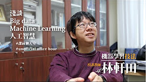
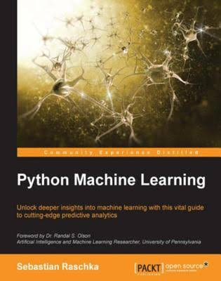
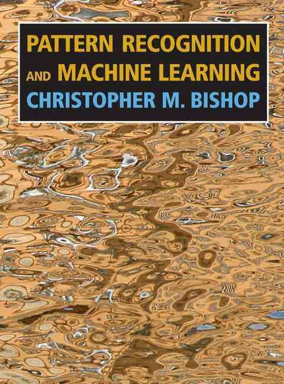

# Courses and books of Artificial Intellegent
Several valuable courses and books related to the technologies of **Aritificial Interllegent (AI)** are provided on internet. The field becomes popular in current, espcailly **Mechine learning (ML)** and **Neural Network (NN)**, even the advance techniques of NN, so called **Deeplearning** are the hot keywords. Here I list the worth-reading metirials which are availible online. They are not just about AI, but the basic knowledges of computing sceince. The collections were gethered here since June of 2017, when I was during military service for a year.   

## Computing Sceince

## Mechine learning

| Coures | Source | Achivment |
| -------- | -------- | -------- |
|   | [**Machine Learning Foundations/Techniques**, *Hsuan-Tien Lin*](https://www.csie.ntu.edu.tw/~htlin/) | :ballot_box_with_check: |

| Book | Source | Achivment |  Note |
| -------- | -------- | -------- | -------- |
|     | [**Machine Learning in Python**, *Sebastian Raschka*](https://sebastianraschka.com/books.html)  | :ballot_box_with_check: | [ Workbooks project](Machine_Learning_in_Python_SR) |
|  | [**Pattern Recognition and Machine Learning**, *Christopher M. Bishop* ](https://books.google.com.tw/books/about/Pattern_Recognition_and_Machine_Learning.html?id=kTNoQgAACAAJ&source=kp_cover&redir_esc=y) | :ballot_box_with_check: |  The reference of [ Workbooks project](Machine_Learning_in_Python_SR) |
