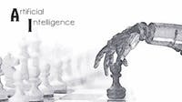
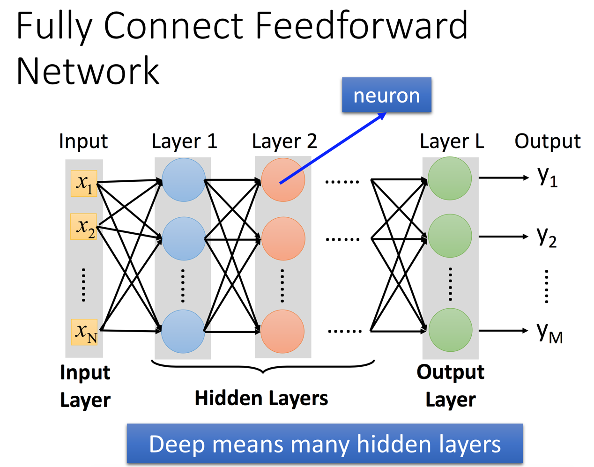
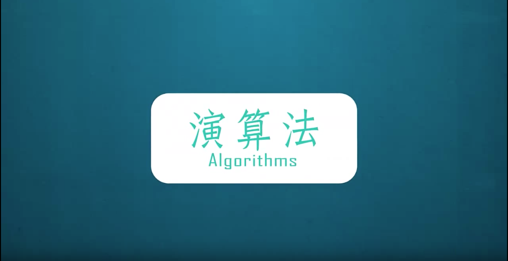

# Courses and books of Artificial Intellegent
Several valuable courses and books related to the technologies of **Aritificial Interllegent (AI)** are provided on internet. The field becomes popular in current, espcailly **Mechine learning (ML)** and **Neural Network (NN)**, even the advance techniques of NN, so called **Deeplearning** are the hot keywords. Here I list the worth-reading metirials which are availible online. They are not just about AI, but the basic knowledges of computing sceince. The collections were gethered here since June of 2017, when I was during military service for a year.   

The following :heavy_check_mark: and :ballot_box_with_check: mean the course/book has been went through completely at least onece and been refered to workbook projects/courses, respectively.

## AI and Mechine learning

| Coures | Source | Progress | Note |
| -------- | -------- | -------- | -------- |
|  |  Coursera: [**Artificial Intelligence**, *Tian-Li Yu, NTU*](https://www.coursera.org/learn/rengong-zhineng) | :heavy_check_mark: | |
|   | Youtube: [**Machine Learning Foundations/Techniques**, *Hsuan-Tien Lin*](https://www.csie.ntu.edu.tw/~htlin/) | :heavy_check_mark: | |
|   | Youtube: [**Deeplearning and Machine Learning**, *Hung-yi Lee, NTU*](https://www.youtube.com/playlist?list=PLJV_el3uVTsPy9oCRY30oBPNLCo89yu49) | :heavy_check_mark: | [NTU link](http://speech.ee.ntu.edu.tw/~tlkagk/courses_ML17_2.html) |

| Book | Source | Progress |  Note |
| -------- | -------- | -------- | -------- |
|     | [**Machine Learning in Python**, *Sebastian Raschka*](https://sebastianraschka.com/books.html)  | :heavy_check_mark: | [Workbooks project 1](Machine_Learning_in_Python_SR) |
|  | [**Pattern Recognition and Machine Learning**, *Christopher M. Bishop* ](https://books.google.com.tw/books/about/Pattern_Recognition_and_Machine_Learning.html?id=kTNoQgAACAAJ&source=kp_cover&redir_esc=y) | :ballot_box_with_check: |  The reference of [Workbooks project 1](Machine_Learning_in_Python_SR) |
|  | [**Neural Network And Deeplearning**, *Michael Nielsen*](http://neuralnetworksanddeeplearning.com). | :heavy_check_mark: |  [Workbooks project 2](Neural_Network_And_Deeplearning_MN) |
|  | [**Learning from Data**, *Yaser S. Abu-Mostafa, Malik Magdon-Ismail, Hsuan-Tien Lin*](http://amlbook.com). | :ballot_box_with_check: | The reference of online course |

## Computing Sceince
| Coures | Source | Progress | Note |
| -------- | -------- | -------- | -------- |
|  |  Youtube: [**演算法 (Algorithm)**, *Iris H-R Jiang, NCTU*](https://www.coursera.org/learn/rengong-zhineng) | :heavy_check_mark: | [NCTU link](http://ocw.nctu.edu.tw/course_detail.php?bgid=8&gid=0&nid=493#.Wi9Kya33VE4) |
